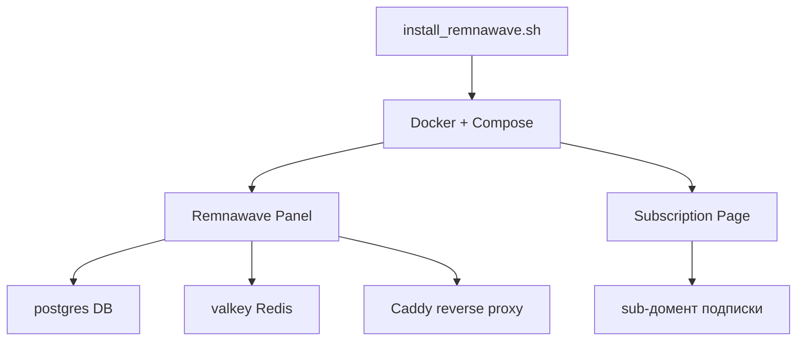

# 🖥️ install-remnawave

> **Красочный установщик панели Remnawave в стиле [btop](https://github.com/aristocratos/btop)** — анимированный ASCII-баннер, box-drawing рамки, цветные прогресс-бары, статус-индикаторы и TUI-меню.

```
  _ __ ___  _ __ ___  _ __   ___  _ __
 | '_ ` _ \| '_ ` _ \| '_ \ / _ \| '_ \
 | | | | | | | | | | | |_) | (_) | | | |
 |_| |_| |_|_| |_| |_| .__/ \___/|_| |_|
                      |_|
```

<sub>Основано на логике [`eGamesAPI/remnawave-reverse-proxy`](https://github.com/eGamesAPI/remnawave-reverse-proxy), переоформлено в живой TUI-стиль.</sub>

---

## 🚀 Быстрый старт

Установи панель одной командой:

```bash
curl -Ls https://raw.githubusercontent.com/Nurulaev/install-remnawave/main/install_remnawave.sh | bash
```

Или скачай и запусти вручную:

```bash
git clone https://github.com/Nurulaev/install-remnawave.git
cd install-remnawave
chmod +x install_remnawave.sh
sudo ./install_remnawave.sh
```

---

## ✨ Что внутри (в стиле btop)

| Элемент | Как выглядит |
|---|---|
| 🎨 **Анимированный баннер** | Арт `remnawave`, раскрашенный градиентом |
| 🗂️ **Box-drawing рамки** | Окна `╭──[ TITLE ]──╮` как панели в btop |
| 📊 **Прогресс-бары** | `██▒▒ 47%` цветные, обновляются вживую |
| ⏳ **Спиннер** | `⠹⠸⠼⠴⠦⠧⠇⠏` анимация при установке |
| ✅ **Статус-индикаторы** | `[✔]`, `[•]`, `[!]`, `[✘]` |
| 🧭 **Меню** | Интерактивный выбор, цифровые пункты |
| 📋 **Итоговая сводка** | btop-панель с результатами после установки |

---

## 🧩 Что устанавливается



| Компонент | Образ | Порт |
|---|---|---|
| Панель | `remnawave/backend:3` | `127.0.0.1:3000` |
| Метрики | (в панели) | `127.0.0.1:3001` |
| БД | `postgres:16` | `127.0.0.1:5432` |
| Кэш | `valkey/valkey:7-alpine` | unix-socket |
| Подписка | `remnawave/subscription-page:latest` | `127.0.0.1:3010` |
| Прокси | `caddy` | `80/443` |

---

## 🔧 Требования

- **Debian / Ubuntu** (на VPS с root)
- Собственный домен, A-записи указывают на IP сервера
- Открытые порты `80` и `443`

---

## 📌 Команды

```bash
# прямая установка
curl -Ls ... | bash install

# показать меню
sudo ./install_remnawave.sh menu

# версия
sudo ./install_remnawave.sh version
```

---

## 📜 Лицензия

Это учебный/демонстрационный проект для изучения установки панели Remnawave и reverse proxy. Логика принадлежит исходному проекту `eGamesAPI/remnawave-reverse-proxy`. Используется по своему усмотрению.

---

**TY poдей:**
- [Remnawave docs](https://docs.rw)
- [Исходный скрипт](https://github.com/eGamesAPI/remnawave-reverse-proxy)
- [btop](https://github.com/aristocratos/btop) (вдохновение для стиля)
